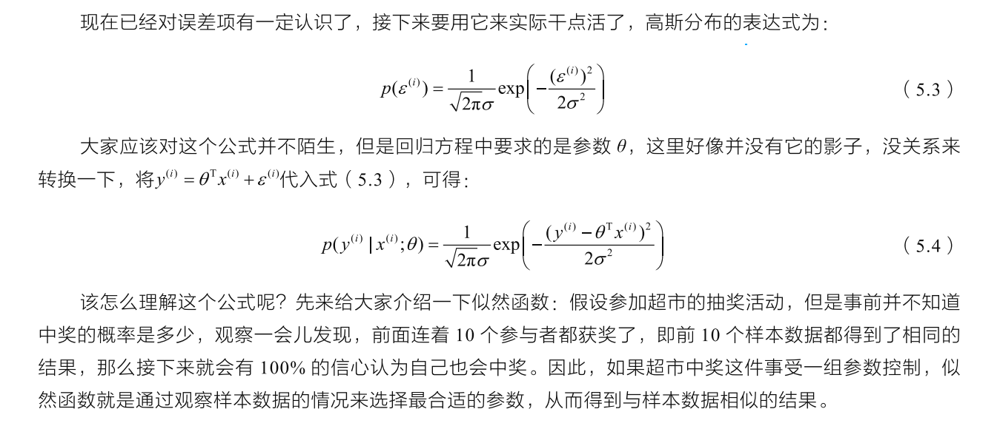
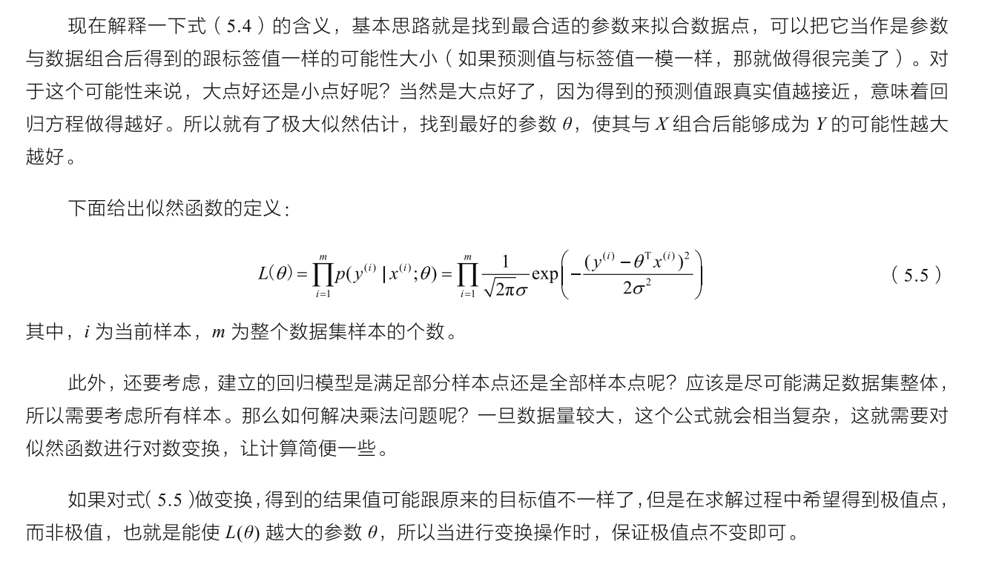
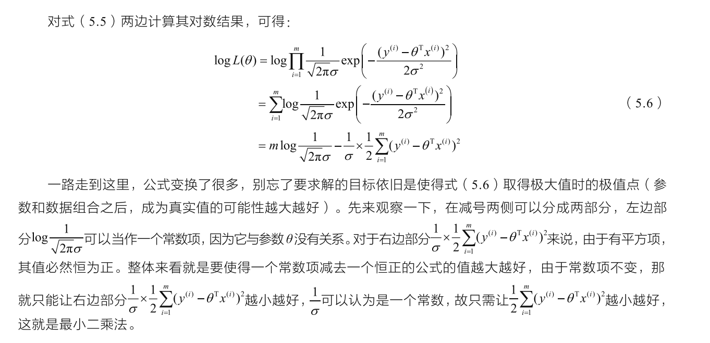
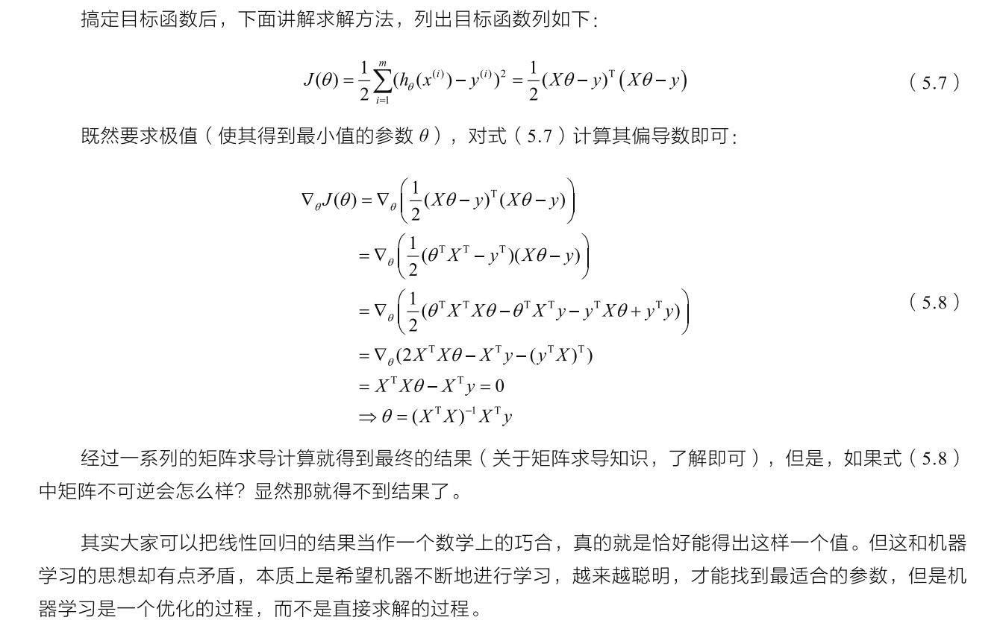
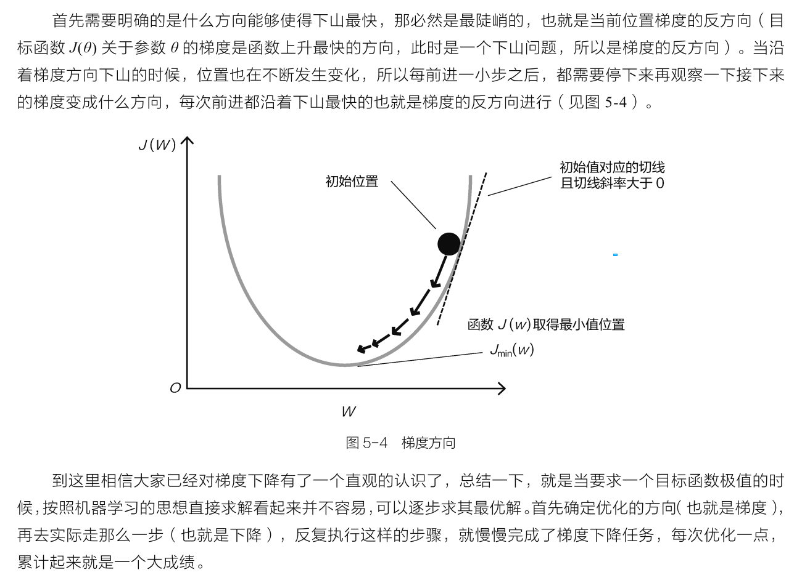
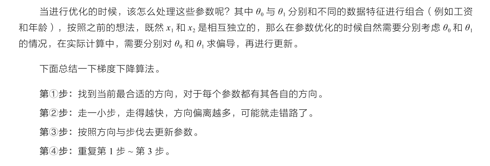

# 线性回归算法

假设有训练数据集 $$(x^{(1)}, y^{(1)}), (x^{(2)}, y^{(2)}), ..., (x^{(m)}, y^{(m)})$$，其中 $x^{(i)}$ 是输入特征，$y^{(i)}$ 是对应的输出。

线性回归的模型假设输出 $y$ 与输入 $x$ 之间存在线性关系，表示为：

$h_\theta(x) = \theta_0 + \theta_1 x_1 + \theta_2 x_2 + ... + \theta_n x_n $

其中：
- $h_\theta(x)$ 是预测值，
- $\theta_0, \theta_1, ..., \theta_n$ 是模型的参数，
- $x_1, x_2, ..., x_n$ 是输入特征。

模型的参数 $\theta_0, \theta_1, ..., \theta_n $ 是通过训练数据学习得到的，目标是使预测值 $h_\theta(x^{(i)})$ 尽可能接近真实输出 $y^{(i)}$。

损失函数（代价函数）用于衡量模型预测值与真实输出之间的差异。对于线性回归，通常采用均方误差（Mean Squared Error）：

$ J(\theta) = \frac{1}{2m} \sum_{i=1}^{m} \left( h_\theta(x^{(i)}) - y^{(i)} \right)^2 $

其中 $m$ 是训练样本数，$J(\theta)$ 是损失函数。

线性回归的目标是找到最优的参数 $\theta$，使损失函数 $J(\theta)$ 最小化。这通常通过梯度下降等优化算法来实现。

> $ J(\theta) = \frac{1}{2m} \sum_{i=1}^{m} \left( h_\theta(x^{(i)}) - y^{(i)} \right)^2 $
>
> 下面会演示最小二乘法求解，以及如何得到

## 误差项分析

假设有训练数据集 $(x^{(1)}, y^{(1)}), (x^{(2)}, y^{(2)}), ..., (x^{(m)}, y^{(m)})$。线性回归模型的误差项（残差）表示为：

$$ \varepsilon^{(i)} = y^{(i)} - h_\theta(x^{(i)}) $$

其中，$ \varepsilon^{(i)} $ 表示第 $i$ 个样本的误差项，$y^{(i)}$ 是真实输出，$h_\theta(x^{(i)})$ 是模型的预测值。

平方误差项（Squared Residuals）用于衡量误差的总体大小，表示为：

$$ \text{SSE} = \sum_{i=1}^{m} (\varepsilon^{(i)})^2 $$

假设有训练数据集 $(x^{(1)}, y^{(1)}), (x^{(2)}, y^{(2)}), ..., (x^{(m)}, y^{(m)})$，其中，$i$ 表示样本编号，$\theta^Tx^{(i)}$ 为预测值，$y^{(i)}$ 为真实值。

关于误差项，其性质可以用以下描述：

> 误差 $\varepsilon$ 是独立的，且具有相同的分布，服从均值为0、方差为$\theta^2$的高斯分布。

解释如下：

- **独立性：** 例如，张三和李四一起来贷款，他们之间没有关系也互不影响，这就是独立关系。

- **相同分布：** 表示误差符合相同的规则。在建立回归模型时，要确保数据在相同的条件下进行比较和分析，避免不同条件下的规则差异。

- **高斯分布：** 用于描述正常情况下误差的状态。在银行贷款的例子中，误差可能在一定范围内浮动，极端情况的可能性较小。高斯分布曲线表明在均值附近的情况发生的可能性较大，而远离均值的情况可能性逐渐减小。

这些性质有助于对误差进行合理的建模和分析。

## 似然函数求解
估计硬币正面朝上的概率的似然函数为：

$ L(p) = \binom{10}{8} p^8 (1-p)^2 $

其中：
- \( n \) 是投掷次数，
- \( k \) 是正面朝上的观察次数，
- $ \binom{n}{k} $ 是组合数。

假设进行了 10 次投掷，观察到 8 次正面朝上。似然函数可以写为：

$ L(p) = \binom{10}{8} p^8 (1-p)^2 $

这个似然函数描述了在给定概率 \( p \) 下观察到 8 次正面朝上的概率。我们的目标是找到使得这个概率最大的 \( p \)。

# 梯度下降算法

优化的目标函数
> $$ J(\theta) = \frac{1}{2m} \sum_{i=1}^{m} \left( h_\theta(x^{(i)}) - y^{(i)} \right)^2 $$

