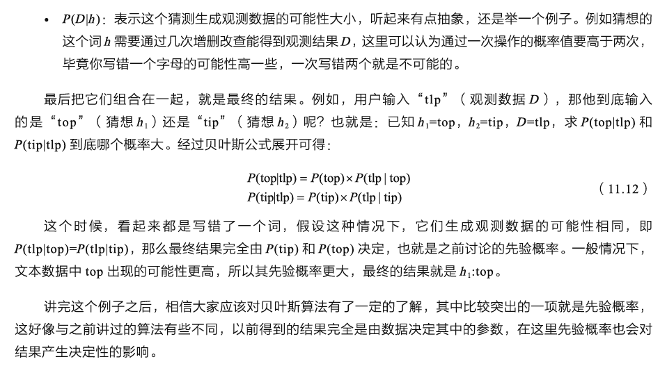
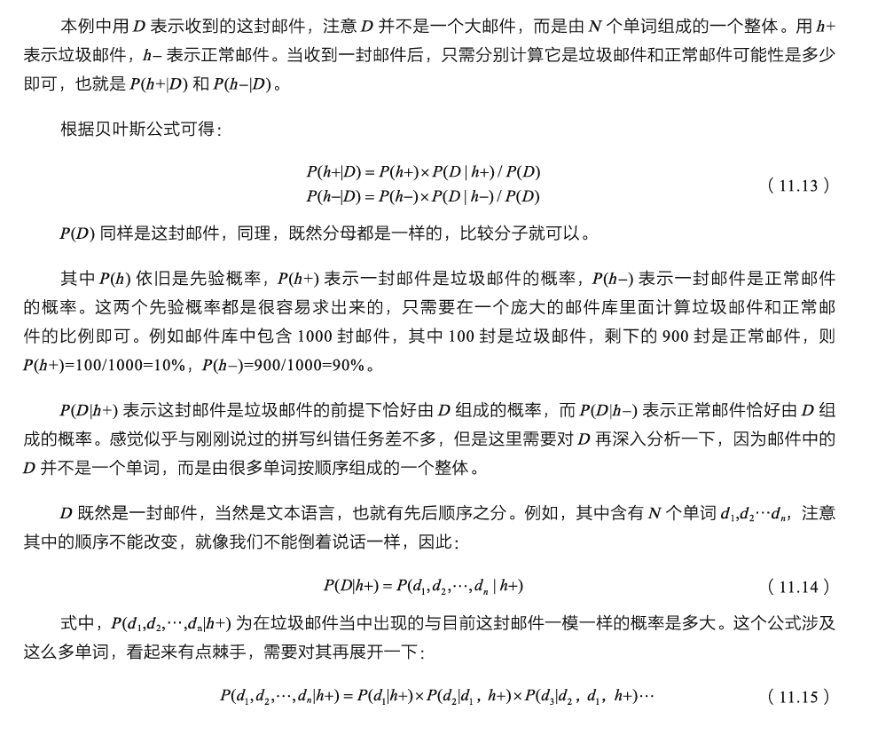

# 贝叶斯算法项目实战——新闻分类

所谓的贝叶斯定理源于他生前为解决一个“逆概”问题而写的一篇文章。先通过一个小例子来理解一下什么是正向和逆向概率。假设你的口袋里面有N个白球、M个黑球，你伸手进去随便拿一个球，问拿出黑球的概率是多大？

　　这个问题可以轻松地解决，但是，如果把这个问题反过来还那么容易吗？如果事先并不知道袋子里面黑白球的比例，而是闭着眼睛摸出一个（或好几个）球，观察这些取出来的球的颜色之后，要对袋子里面的黑白球的比例作推测。好像有一点绕，这就是逆向概率问题。接下来就由一个小例子带大家走进贝叶斯算法。

下面再来分析一下要求解的问题：迎面走来一个穿长裤的学生，你只看得见他（她）穿的是长裤，而无法确定他（她）的性别，你能够推断出他（她）是女生的概率是多大吗？这个问题概括起来就是，首先是一个穿长裤的学生，这是第一个限定条件，接下来这个人还得是女生，也就是第二个条件。总结起来就是：穿长裤的人里面有多少是女生。
## 拼写纠错
例如，用户本来想输入“the”，但是由于打字错误，输成“tha”，那么程序能否猜出他到底想输入哪个单词呢？可以用下式表示：

　　P（猜测他想输入的单词|他实际输入的单词）（11.9）

　　例如，用户实际输入的单词记为D（D代表一个具体的输入，即观测数据），那么可以有很多种猜测：猜测1，P(h1|D)；猜测2，P(h2|D)；猜测3，P(h3|D)等。例如h1可能是the，h2可能是than，h3可能是then，到底是哪一个呢？也就是要比较它们各自的概率值大小，哪个可能性最高就是哪个。

　　先把上面的猜想统一为P(h|D)，然后进行分析。直接求解这个公式好像难度有些大，有点无从下手，但是刚刚不是得到贝叶斯公式吗？转换一下能否好解一些呢？先来试试看：

## 垃圾邮箱分类

